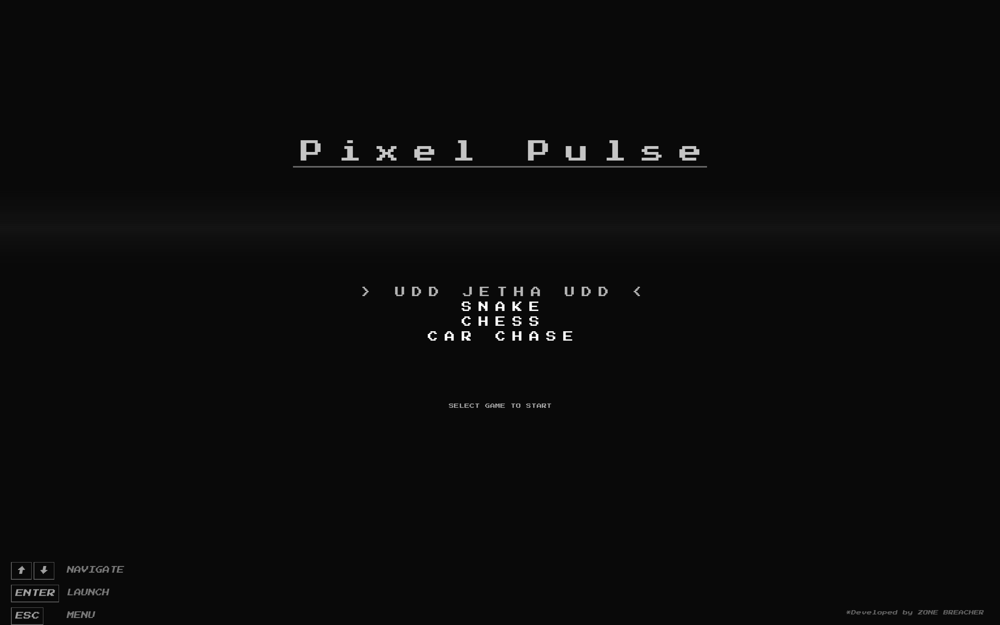

#  Pixel Pulse 


This is the Retro style version of the gaming console with a collection of classic mini games. 
## Games 
- Snake
- Flappy bird
- Rocket Shooter
- Cricket game
- Dino game
## Preview

## Built With


## Team 
| Member | Game |
| -------- | ------- |
| <a href="https://github.com/Aashutosh-kc">Aashutosh KC</a> | Snake |
| <a href="https://github.com/AbhiDevkota">Abhi Devkota</a> | Menu / Homescreen |
| <a href="https://github.com/PrabinDhungana000">Prabin Dhungana</a> | Cricket |
| <a href="https://github.com/Samyam1070">Samyam Khadka</a> | Rocket Shooter |
| <a href="https://github.com/sunim4125">Sunim Fuyal</a> | Dino game |
## How to Run
1. Clone the repo
```bash
git clone https://github.com/AbhiDevkota/PixelPulse.git
```

```bash
cd PixelPulse
```
2. Open `CMakeLists.txt` in Visual Studio and let CMake configure it 
3. Select **CoreZone.exe** as startup item
4. Hit the green play button
